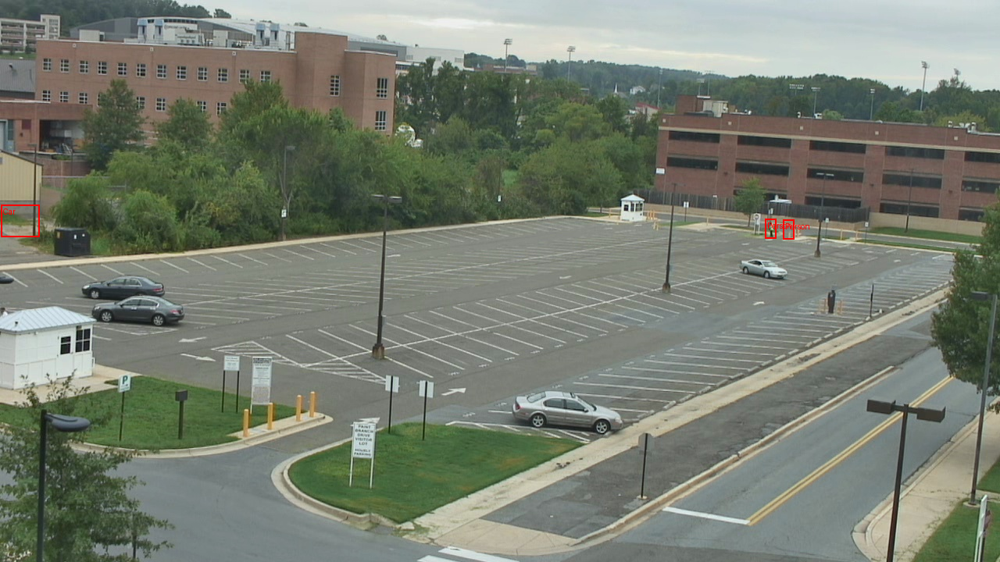
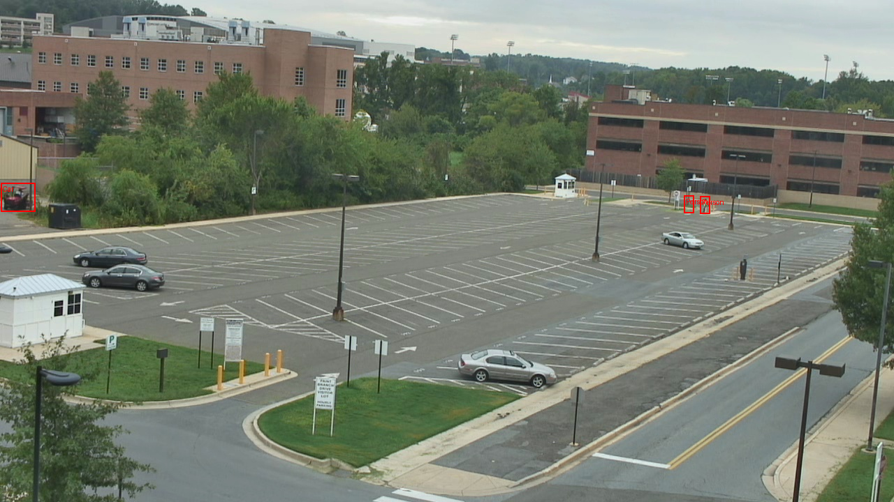
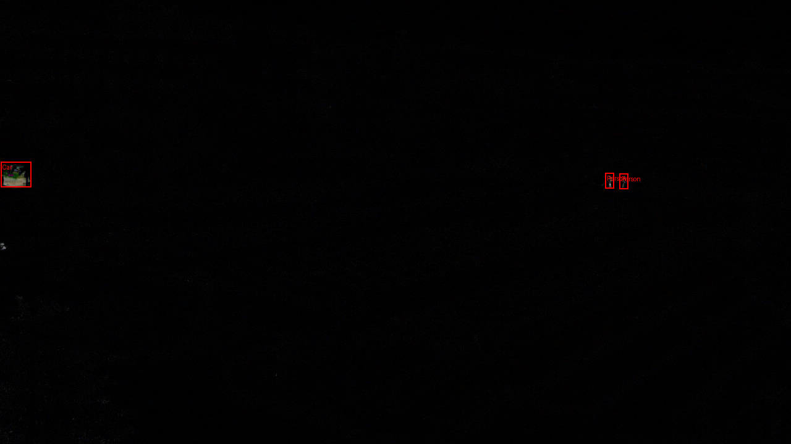

### Description
In this project, a faster R-CNN based model that could detect and classify moving objects based on the difference between pairs of images seperated by a given (usually 60) frames inverval is trained. After training and fine-tuning, the model achieved a precision of 0.8415, which indicates a relatively high accuracy in identifying relevant objects while reducing false positives

### Data and Preprocessing
The original data (videos) is downloaded from https://data.kitware.com/#collection/56f56db28d777f753209ba9f/folder/56f570368d777f753209baac.

To preprocessing the data, `annotations.py` could be run to manual annotate the original data

The processed data could be found at directory `data`

### Training and Evaluation
For training, a faster R-CNN (ResNet-50-FPN) model pretained on COCO dataset is used with the loss function of cross-entropy combining with bounding box regression loss. 

For evaluation, I did cross-validation and computed precision, recall and accuracy (percentage of objects categorized correctly) at an IoU threshold of 0.5.

### Results
You can find the evaluated results at the directory `results`

Here's some examples:

